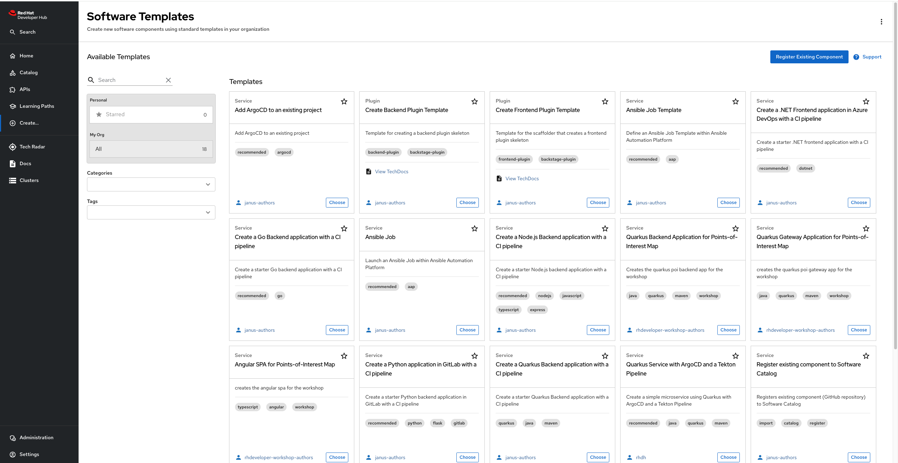
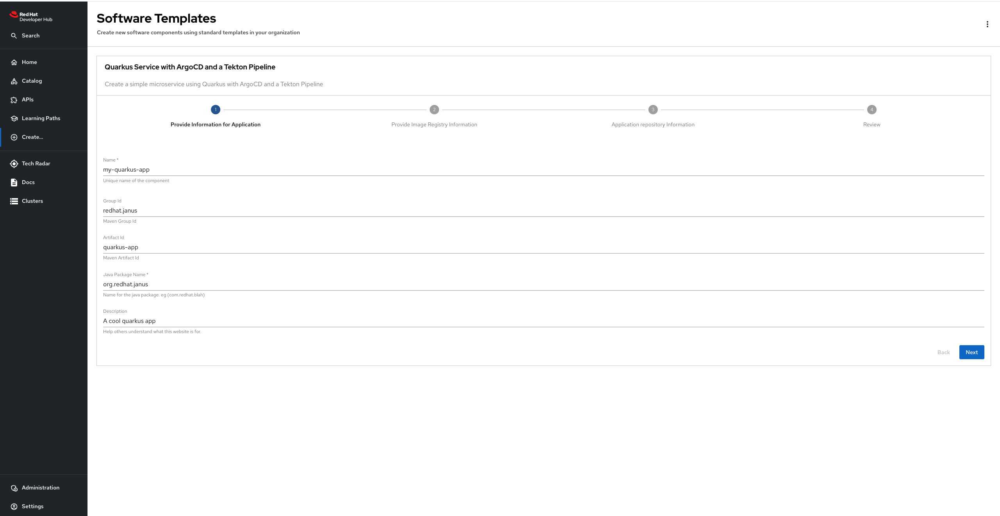
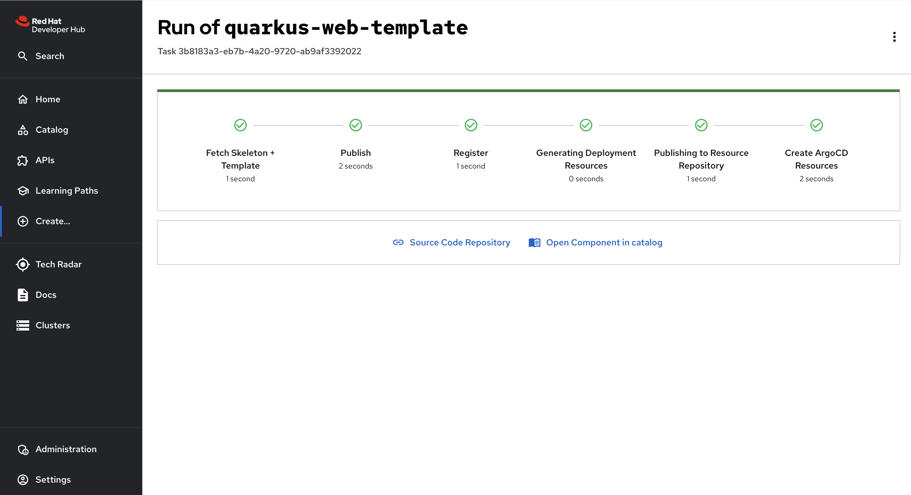
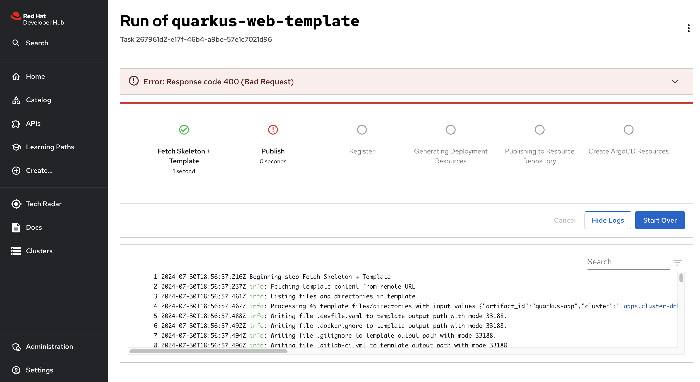
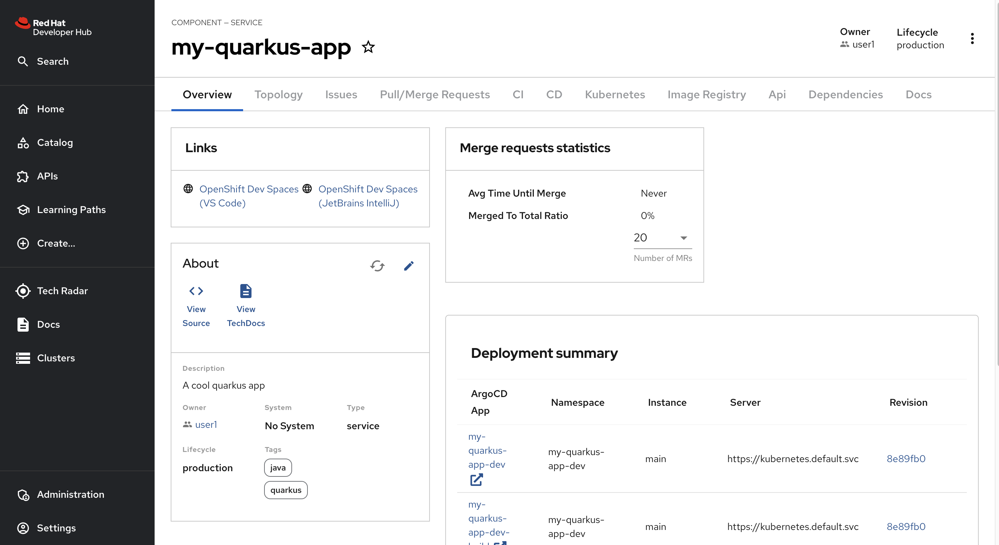
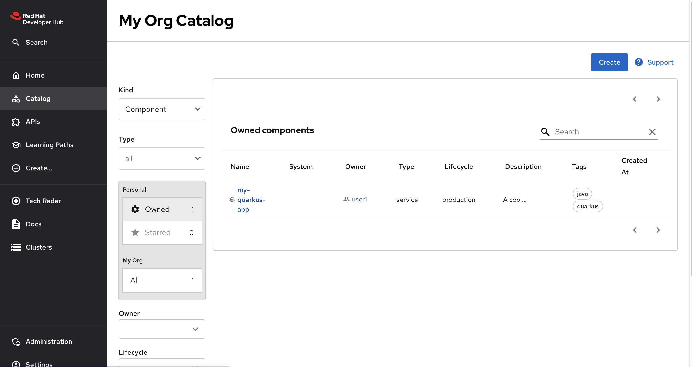
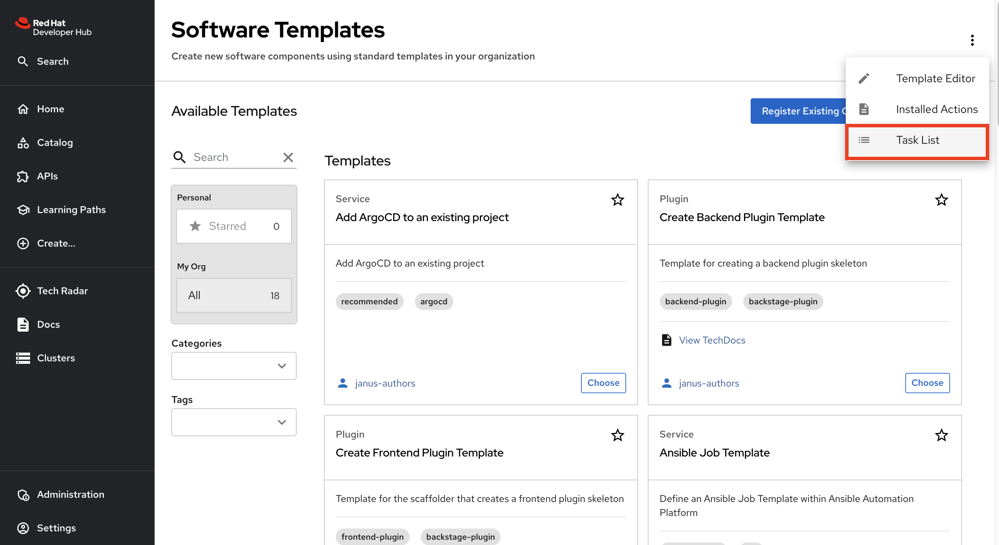
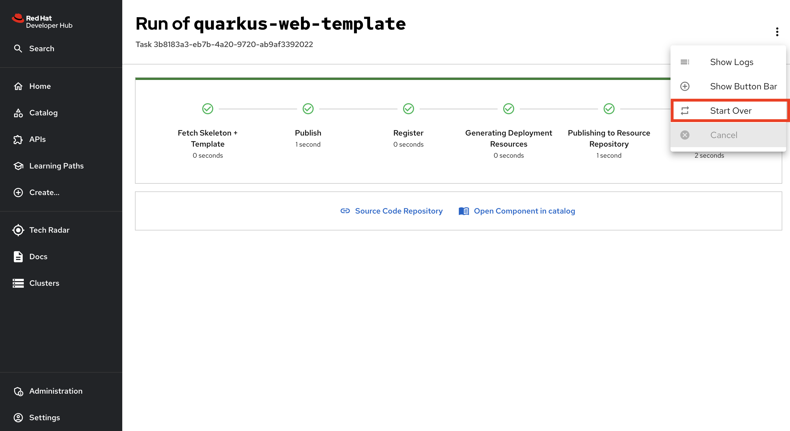

# Red Hat Developer Hub Software Templates 

## Welcome to Templates

Welcome to the Red Hat Developer Hub Software Templates Repository. This repository contains a collection of software templates designed to illustrate best practices in software development and deployment. Our templates cover a wide range of technologies and frameworks, ensuring you have a suitable starting point for your project's needs.

<iframe
  width="640"
  height="480"
  src="https://www.youtube.com/watch?v=tvVOC0mFR_4"
  frameborder="0"
  allow="autoplay; encrypted-media"
  allowfullscreen
>
</iframe>

## Overview

### Software / Golden Templates

Software / Golden Templates are pre-configured, best practice templates that are considered the standard for certain types of applications or environments. They are maintained with the latest recommendations and practices. Using Software Templates can help ensure that your projects adhere to industry standards and organizational policies.

Our software templates are crafted to provide you with a solid foundation for your projects. Each template is a blueprint that includes predefined configurations, dependencies, and deployment procedures. These templates are intended to help you quickly set up and deploy applications with industry best practices.

## Disclaimer

The software templates provided in this repository are examples meant to serve as a starting point. Users are strongly encouraged to customize and modify these templates to fit their specific project requirements and organizational standards. 

By using these templates, you agree to do so at your own risk and discretion. Red Hat shall not be liable for any direct, indirect, incidental, special, exemplary, or consequential damages (including, but not limited to, procurement of substitute goods or services; loss of use, data, or profits; or business interruption) however caused and on any theory of liability, whether in contract, strict liability, or tort (including negligence or otherwise) arising in any way out of the use of these templates, even if advised of the possibility of such damage.

### Customization

Each template in this repository is designed with adaptability in mind, allowing for easy adjustments in configuration, dependencies, and deployment procedures. We strongly encourage users to:

*    Modify templates to suit their specific project requirements.
*    Adjust configurations to align with organizational standards.
*    Adapt deployment procedures to fit their unique environments.

Please note that all templates are unsupported and unmaintained. Users should adapt them for their needs and use them at their own risk.

## Getting Started

Be sure to have covered [Getting Started with Developer Hub](https://developers.redhat.com/rhdh/getting-started) before proceeding. The Software Templates are available under /create. 

Once there, you should see something that looks similar to this:

   
## Choose a template

When you select a template that you want to create, you'll be taken to the next page which may or may not look different for each template. Each template can ask for different input variables, and they are then passed to the templater internally.

   
## Run!

Once you've entered values and confirmed, you'll then get a page with live progress of what is currently happening with the creation of your template. It shouldn't take too long, and you'll have a success screen!

   
If it fails, you'll be able to click on each section to get the log from the step that failed which can be helpful in debugging.

You can also cancel the running process. Once you clicked on button "Cancel", the abort signal will be sent to a task and all next steps won't be executed. The current step will be cancelled only if it supports it.

   
## View Component in Catalog
When it's been created, you'll see the View in Catalog button, which will take you to the registered component in the catalog:

 
   
And then you'll also be able to see it in the Catalog View table:

 

   
## Previewing and Executing Previous Template Tasks

Each execution of a template is treated as a unique task, identifiable by its own unique ID. To view a list of previously executed template tasks, navigate to the "Create" page and access the "Task List" from the context menu (represented by the vertical ellipsis, or 'kebab menu', icon in the upper right corner).

 
   
If you wish to re-run a previously executed template, navigate to the template tasks page. Locate the desired task and select the "Start Over" option from the context menu.

 
   
This action will initiate a new execution of the selected template, pre-populated with the same parameters as the previous run, but these parameters can be edited before re-execution.

In the event of a failed template execution, the "Start Over" option can be used to re-execute the template. The parameters from the original run will be pre-filled, but they can be adjusted as needed before retrying the template.

## Template List

Below is a table of templates along with their related tags and links to their respective directories (accurate as of the time of writing). Users should exercise discretion when using these templates.
   

| Name | Link | Tags 
| :-- | :------: | ----: |
Pipeline to clones git repo, builds a Docker image with Buildah| https://github.com/janus-api-idp/platform-components/tree/main/bitbucket-helm | Helm, Kubernetes, Chart, Bitbucket
Bootstraps a new Backstage applicatiopn using Helm | https://github.com/janus-api-idp/platform-components/tree/main/backstage-helm | Helm, Backstage, Chart
Create A Cert-Issuer chart using Helm for Kubernetes|https://github.com/janus-api-idp/platform-components/tree/main/cert-issuer-helm|Helm, Kubernetes, Chart, ClusterIssuer
Create A Gitea chart using Helm for Kubernetes|https://github.com/janus-api-idp/platform-components/tree/main/gitea-helm|Postgresql, Helm, Chart, Deployment , Kubernetes
Create A KeyCloak chart using Helm for Kubernetes|https://github.com/janus-api-idp/platform-components/tree/main/keycloak-helm|Keycloak, Helm, Chart, Kubernetes
Create A Microcks chart using Helm for Kubernetes|https://github.com/janus-api-idp/platform-components/tree/main/microcks-helm|Microcks, Helm, Chart, Kubernetes
Create A MongoDB chart using Helm for Kubernetes|https://github.com/janus-api-idp/platform-components/tree/main/mongodb-helm|MongoDb, Helm, Chart, Kubernetes
Create A PostgresSql chart using Helm for Kubernetes|https://github.com/janus-api-idp/platform-components/tree/main/postgresql-helm|Postgresql, Bitnami, Helm, Chart
Create Certificate Manager Operator Namespace|https://github.com/janus-api-idp/platform-components/tree/main/operators/cert-manager|Operator, OenShift Pipeline
Create Keycloak Operator Namespace|https://github.com/janus-api-idp/platform-components/tree/main/operators/keycloak|Operator, OenShift Pipeline, Keycloak
Create Microcks Operator Namespace|https://github.com/janus-api-idp/platform-components/tree/main/operators/microcks|Operator, OenShift Pipeline, Microcks
Create  Openshift-Pipeline Operator Namespace|https://github.com/janus-api-idp/platform-components/tree/main/operators/openshift-pipelines|Operator, OenShift Pipeline
Create a Spring Boot microservice for Catalog |https://github.com/WindTurbineInc/software-templates/tree/master/scaffolder-templates/gitlab/coolstore/catalog-spring-boot|Java, Maven, Coolstore, Spring Boot, Demo, GitLab
Create a Vertx microservice for Gateway|https://github.com/WindTurbineInc/software-templates/tree/master/scaffolder-templates/gitlab/coolstore/gateway-vertx|Java, Maven, Coolstore, Demo, GitLab, Vertx
Create a Quarkus microservice for Inventory|https://github.com/WindTurbineInc/software-templates/tree/master/scaffolder-templates/gitlab/coolstore/inventory-quarkus|Java, Quarkus, Maven, Coolstore, Demo, GitLab
Create a NodeJS microservice for Web app|https://github.com/WindTurbineInc/software-templates/tree/master/scaffolder-templates/gitlab/coolstore/web-nodejs|NodeJs, Web, Coolstore, Demo, GitLab
Create Go API backend for the Vote App|https://github.com/WindTurbineInc/software-templates/tree/master/scaffolder-templates/gitlab/vote-api-go|ArgoCD, Go, Tekton, Vote, Backend, GitLab
Create Python UI frontend for the Vote App|https://github.com/WindTurbineInc/software-templates/tree/master/scaffolder-templates/gitlab/vote-ui-python|Python, Tekton, ArgoCD, Vote, Frontend, GitLab
Create Angular SPA for Points-of-Interest Map|https://github.com/WindTurbineInc/software-templates/tree/master/scaffolder-templates/poi-map|Typescript , Angular, Workshop
Python application to show Gen AI with OpenShift AI|https://github.com/WindTurbineInc/software-templates/tree/master/scaffolder-templates/wheres-teddy|Python, GenAI, Data Science , NodeJs
Where's Teddy Python application to show Gen AI with OpenShift AI|https://github.com/WindTurbineInc/software-templates/tree/master/scaffolder-templates/wheres-teddy/|Python, NodeJs, GenAI, Data Science , GitHub
Quarkus Java - Trusted Application Pipeline|https://github.com/redhat-appstudio/tssc-sample-templates/tree/main/templates/devfile-sample-code-with-quarkus-dance|Java, sscs, sbom, acs, Quarkus
C# .NET - Trusted Application Pipeline|https://github.com/redhat-appstudio/tssc-sample-templates/tree/main/templates/devfile-sample-dotnet60-dance|.Net, C#, sscs, sbom, acs
Go Runtime - Trusted Application Pipeline|https://github.com/redhat-appstudio/tssc-sample-templates/tree/main/templates/devfile-sample-dotnet60-dance|sscs, sbom, acs, Go
Spring Boot - Trusted Application Pipeline|https://github.com/redhat-appstudio/tssc-sample-templates/tree/main/templates/devfile-sample-java-springboot-dance|Java, sscs, sbom, acs, Spring Boot, Maven, Rest
Node.js Express - Trusted Application Pipeline|https://github.com/redhat-appstudio/tssc-sample-templates/tree/main/templates/devfile-sample-nodejs-dance|sscs, sbom, acs, ubi8, NodeJs, Express
Python - Trusted Application Pipeline|https://github.com/redhat-appstudio/tssc-sample-templates/tree/main/templates/devfile-sample-python-dance|Python, sscs, sbom, acs, pip
Chatbot Application|https://github.com/redhat-ai-dev/ai-lab-template/tree/main/templates/chatbot|AI, Python, VLLM, LLAMACPP
Audio to Text Application|https://github.com/redhat-ai-dev/ai-lab-template/tree/main/templates/audio-to-text|ASR, Python, AI, Whispercpp
Create frontend app for the workshop|https://github.com/rh-mad-workshop/coolstore-software-templates/tree/main/scaffolder-templates/frontend|npm, Frontend, Workshop
Create Java gateway app for the workshop|https://github.com/rh-mad-workshop/coolstore-software-templates/tree/main/scaffolder-templates/gateway|vertx, Java, Maven, Workshop
Create Quarkus backend app for the workshop|https://github.com/rh-mad-workshop/coolstore-software-templates/tree/main/scaffolder-templates/quarkus-backend|Java, Quarkus, Maven, Workshop
Create Spring Boot Backend app for the workshop|https://github.com/rh-mad-workshop/coolstore-software-templates/tree/main/scaffolder-templates/spring-backend|Java, Spring Boot, Maven, Workshop
Creates a Tomcat VM|https://github.com/rh-mad-workshop/coolstore-software-templates/tree/demo-vm/scaffolder-templates/tomcat-vm|VM, Tomcat,
RHEL9 VM Medium Template|https://github.com/rh-mad-workshop/coolstore-software-templates/tree/demo-vm/scaffolder-templates/rhel9-vm-medium|VM, Tomcat, rhel9-medium
RHEL9 VM Large Template|https://github.com/rh-mad-workshop/coolstore-software-templates/blob/demo-vm/scaffolder-templates/rhel9-vm-large/template.yaml|VM, Tomcat,, rhel9-large
Create a Qusarkus Application|https://github.com/q-shift/backstage-playground/tree/main/locations/templates/quarkus-application|Java, Quarkus, Maven
Create a Quarkus application using https://code.quarkus.io|https://github.com/q-shift/qshift-templates/tree/main/qshift/templates/quarkus-application|Java, Maven, Quarkus
Create a Quarkus Chatbot that consumes an API|https://github.com/q-shift/backstage-playground/tree/main/locations/templates/quarkus-chatbot|Java, Quarkus, Maven
Create a Quarkus Application from Quickstarts|https://github.com/q-shift/backstage-playground/tree/main/locations/templates/quarkus-quickstart|Java, Quarkus, Maven
Create a Quarkus Rest Client Application|https://github.com/q-shift/backstage-playground/tree/main/locations/templates/quarkus-rest-client|Java, Quarkus, Maven
Example Node.js Template|https://github.com/q-shift/qshift-templates/tree/main/kubernetes|Kubernetes, NodeJs
Create an Autolink Reference|https://github.com/JessicaJHee/rhdh-software-templates-temp/tree/main/templates/github/create-autolink-ref|GitHub
Dispatch a GitHub Action Workflow|https://github.com/JessicaJHee/rhdh-software-templates-temp/tree/main/templates/github/dispatch-github-action|GitHub
Create a Node.js web application in Azure DevOps|https://github.com/JessicaJHee/rhdh-software-templates-temp/tree/main/templates/nodejs-azure-app|NodeJs, Javascript, Express
GitHub Push template|https://github.com/idp-team/software-templates/tree/master/scaffolder-templates/github-push-template|GitHub, Backstage, SCM
Pull Request Action template|https://github.com/idp-team/software-templates/tree/master/scaffolder-templates/pull-request-template|GitHub, Backstage, SCM
Quarkus Service with ArgoCD and a Tekton Pipeline|https://github.com/idp-team/software-templates/tree/master/scaffolder-templates/quarkus-web-template|Quarkus, Java, Maven
Create Quarkus Backend Application for Points-of-Interest Map|https://github.com/WindTurbineInc/software-templates/tree/master/scaffolder-templates/poi-backend|Java, Quarkus, Maven, Workshop
Create Quarkus Gateway Application for Points-of-Interest Map|https://github.com/WindTurbineInc/software-templates/tree/master/scaffolder-templates/poi-gateway|Java, Quarkus, Maven, Workshop
Trigger  Helm-charts-pipeline |https://github.com/idp-team/platform-iac/tree/pipeline/helm-charts-pipeline/trigger-template|GitHub, Helm, Tekton
Typescript Template for building GraphQL Subgraphs|https://gitlab.cee.redhat.com/app-dev-platform/backstage-software-templates/-/tree/main/templates/rhg-subgraph-template?ref_type=heads|Dx, GraphQL, Subgraph, Typescript 
Create a Quay repository|https://github.com/janus-idp/backstage-plugins/blob/main/plugins/quay-actions/examples/templates/01-quay-template.yaml|Quay
Create Java Quarkus Wind Turbine Game Template |https://github.com/WindTurbineInc/software-templates/tree/master/scaffolder-templates/quinoa-wind-turbine|Java, Quarkus, Maven, Quinoa, Game, Demo
Quarkus Application Patch Template|https://github.com/developer-hub-books/rhdh-book1-templates/tree/main/custom-component-patch|Quarkus, Patch, Book
Staged Deployment Patch Template|https://github.com/developer-hub-books/rhdh-book1-templates/tree/main/custom-deployment-patch|Quarkus, Patch, Book, Deployment 
Create a NestJS Service with backing PostgreSQL Database|https://github.com/developer-hub-books/rhdh-book1-templates/tree/main/nestjs-with-postgres|NodeJs, NestJS, Postgresql, Book, Database
Create Quarkus Service with hosted Angular Frontend|https://github.com/developer-hub-books/rhdh-book1-templates/tree/main/quarkus-with-angular|Java, Quarkus, Quinoa, Angular, Book
Create an Ansible Job|https://github.com/redhat-developer/red-hat-developer-hub-software-templates/tree/main/templates/github/define-ansible-job|Janus Idp, Ansible
Create a Go Backend application with a CI pipeline|https://github.com/redhat-developer/red-hat-developer-hub-software-templates/blob/main/templates/github/go-backend/template.yaml|Go, Backend, CI Pipeline, Janus Idp
Launch an Ansible Job within Ansible Automation Platform|https://github.com/redhat-developer/red-hat-developer-hub-software-templates/tree/main/templates/github/launch-ansible-job|Ansible, Janus Idp
Create a Node.js Backend application with a CI pipeline|https://github.com/redhat-developer/red-hat-developer-hub-software-templates/tree/main/templates/github/nodejs-backend|NodeJs, Express, Javascript, Typescript 
Add OBC to an existing project|https://github.com/redhat-developer/red-hat-developer-hub-software-templates/tree/main/templates/github/obc|Janus Idp, OBC
Create a Quarkus Backend application with a CI pipeline|https://github.com/redhat-developer/red-hat-developer-hub-software-templates/tree/main/templates/github/quarkus-backend|Java, Maven, Quarkus, Janus Idp, Backend
Register existing component to Software Catalog|https://github.com/redhat-developer/red-hat-developer-hub-software-templates/tree/main/templates/github/register-component|Janus Idp, GitHub
SDLC environments Application|https://github.com/redhat-developer/red-hat-developer-hub-software-templates/tree/main/templates/github/sdlc-app|SDLC
Create a Spring Boot Backend application with a CI pipeline|https://github.com/redhat-developer/red-hat-developer-hub-software-templates/tree/main/templates/github/spring-boot-backend|Spring Boot, Java, Maven
Create a Techdocs sample|https://github.com/redhat-developer/red-hat-developer-hub-software-templates/tree/main/templates/github/techdocs|Techdocs, Documentation, Janus Idp
Create a tekton CI Pipeline|https://github.com/redhat-developer/red-hat-developer-hub-software-templates/tree/main/templates/github/tekton|Tekton, CI Pipeline, Janus Idp, Backend
Create a Python backend application in GitLab with a CI pipeline|https://github.com/redhat-developer/red-hat-developer-hub-software-templates/tree/main/templates/gitlab/python-backend|Python, GitLab, CI Pipeline, Backend, Flask
Create a .NET Frontend application with a CI pipeline|https://github.com/redhat-developer/red-hat-developer-hub-software-templates/tree/main/templates/azure/dotnet-frontend|.Net, Frontend
Add ArgoCD to an existing project|https://github.com/redhat-developer/red-hat-developer-hub-software-templates/blob/main/templates/github/argocd/template.yaml|ArgoCD
Template for creating a backend plugin skeleton|https://github.com/redhat-developer/red-hat-developer-hub-software-templates/tree/main/templates/create-backend-plugin|Janus Idp, Frontend, Backend
Create Frontend Plugin Template|https://github.com/redhat-developer/red-hat-developer-hub-software-templates/blob/main/templates/create-frontend-plugin/template.yaml|Janus Idp, Frontend, Backend

  

## Contributing

We welcome contributions to this repository. If you have a template that you would like to share, please follow these steps:
Fork this repository.

* Create a new branch for your template.
* Add your template to the appropriate directory.
* Submit a pull request for review.

## Contact
If you have any questions or need further assistance, please reach out to the Red Hat Developer Hub team by creating a Jira Ticket at  : link?
Thank you for using the Red Hat Developer Hub Software Templates Repository!
